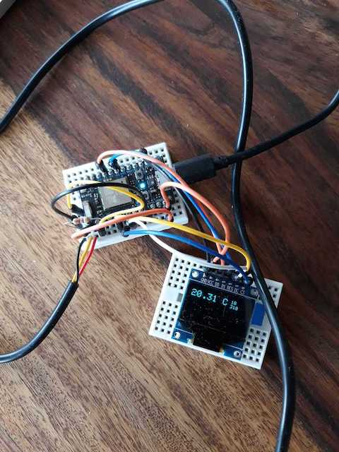

# aqua_iot

A simple Particle project for monitoring temperature in aquarium.

Features:
* Sends value via MQTT to Home Assistant
* Publishes measurement to Particle Cloud
* Presents measurement value on a screen
